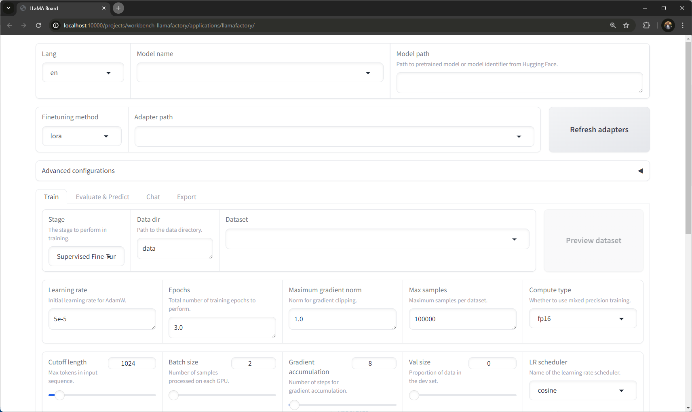

## LLaMA-Factory - AI Workbench Project

This is an [NVIDIA AI Workbench](https://www.nvidia.com/en-us/deep-learning-ai/solutions/data-science/workbench/) project to deploy [LLaMA-Factory](https://github.com/hiyouga/LLaMA-Factory).

**Please follow the LLM fine-tuning tutorial for [RTX AI Toolkit here](https://github.com/NVIDIA/RTX-AI-Toolkit/blob/main/tutorial-llama3-finetune.md).**

Minimum recommended Workbench ver: 0.50.16

Docker Desktop ver. 4.31+

## Features

- Fine-tune an LLM using Llama factory.
- Fuse generated LoRA adapter with the base model.
- Apply Post Training Quantization to your model.
- Export model to TensorRT-LLM checkpoint.
- Support for unsloth.

